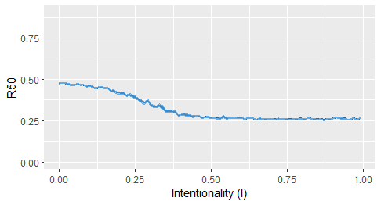

# FWebs (v. 0.1.1) - Downloading and processing food web datasets

Download food web datasets from online databases, process, compute structural metrics and evaluate robustness. 

DISCLAIMER: This is development version. The code is continuously being subjected to improvements. Any suggestions are welcomed!

In the blog Geekcologist I provided an example of the use of some of these functions: https://geekcologist.wordpress.com/2020/02/06/function-to-download-biotic-interaction-datasets/

# 1. Install the package  
```{r}
library(devtools) 
install_github("FMestre1/fw_package")
library(FWebs)
```

# 2. Create food web list (from the mangal database as an example)
```{r}
mg1 <- create.fw.list(db="mg", ref=TRUE, spatial = TRUE)
```

# 3. Which are  adjacency matrices (0 and 1 matrices)?
```{r}
is.adjacency.matrix(mg1)
```

## 3.1.Need to convert to adjacency (not needed here)?
```{r}
mg2 <- convert2adjacency(mg1)
is.adjacency.matrix(mg2)
```

# 4. Which are square matrices (same number of columns and rows)?
```{r}
is.sq.matrix(mg1) 
```

## 4.1. Need to convert to square matrix (not needed here)?
```{r}
mg3 <- rec2square(mg2)
is.sq.matrix(mg3)
```

# 5. Deriving Food Web metrics
```{r}
metrics <- fw.metrics(mg1)

metrics
```

# 6. Plot the degree distribution of all food webs in the dataset
```{r}
dd.fw(mg1, log=TRUE, cumulative=TRUE)
```

# 7. Evaluate the robustness of a food web to disturbance
```{r}
#Convert to list a list of ghraph objects
graph_list1 <- convert.to.graph.list(mg1)

#Create a vector with the values for the Intentionality Index (I)
i_index <- seq(from = 0, to = 1, by =0.01)
i_index <- head(i_index,-1)

#Extract one food web as example
fw1 <- graph_list1[[40]]

#Compute the probability to remove each species 
prob_exp <- exponent.removal(fw1, i_index)

#Simulate the extraction of species to evaluate how many primary extinctions are required to have 50% of the total species extinguished
it1 <- iterate(fw_to_attack=fw1, prob_exp, alpha1=50, iter=10, i_index, plot = TRUE)
```



